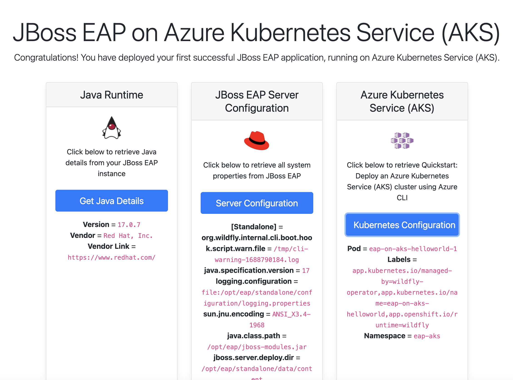

# Red Hat JBoss EAP on Azure Kubernetes Service (AKS) Kubernetes Service Hello World

This is a simple application that demonstrates a basic deployment of an Java application on Wildfly (JBoss EAP) on Azure Kubernetes Service. The applicatoin is a _properties browser_ type app that you can explore the properties of the deployed app. This makes the app useful for demonstrating the correlation between the actual deployed app and the environment.

## Prerequisites
* [Azure subscription](https://azure.microsoft.com/en-us/free/)
* [Azure CLI](https://learn.microsoft.com/en-us/cli/azure/install-azure-cli?WT.mc_id=java-9121-yoterada)
* [kubectl](https://kubernetes.io/docs/tasks/tools/)


## Create a new Azure Kubernetes Service (AKS) cluster - 10 min

 * [Quickstart: Deploy an Azure Kubernetes Service (AKS) cluster using Azure CLI](https://learn.microsoft.com/en-us/azure/aks/learn/quick-kubernetes-deploy-cli)

## Install a Wildfly operator - 7 min

 * Install Operator Lifecycle Manager (OLM), a tool to help manage the Operators running on your AKS cluster.

```
curl -sL https://github.com/operator-framework/operator-lifecycle-manager/releases/download/v0.25.0/install.sh | bash -s v0.25.0
```

 * Install the operator by running the following command. This Operator will be installed in the "operators" namespace and will be usable from all namespaces in the cluster.

```
$ kubectl create -f https://operatorhub.io/install/wildfly.yaml
```

 * After installation, watch your operator come up using the next command.

```
kubectl get csv -n operators
```

To use it, checkout the custom resource definitions (CRDs) introduced by this operator to start using it.

## Create a Wildfly CR - 7 min

 * Create a wildfly.yaml and copy the following content.

 ```
apiVersion: wildfly.org/v1alpha1
kind: WildFlyServer
metadata:
name: quickstart
spec:
applicationImage: 'quay.io/danieloh30/eap-on-aks-helloworld-main:1.2'
replicas: 2
```
 
 * Verify the EAP server -  2 min

```
kubectl logs eap-on-aks-helloworld-0
```

 * The output should look like this.

```
...
21:24:25,029 INFO  [org.jboss.weld.Bootstrap] (Weld Thread Pool -- 1) WELD-000119: Not generating any bean definitions from org.jboss.helloworld.RestApplication because of underlying class loading error: Type Failed to link org.jboss.helloworld.RestApplication (Module "deployment.helloworld-eap.war" from Service Module Loader): javax.ws.rs.core.Application not found.  If this is unexpected, enable DEBUG logging to see the full error.
21:24:25,605 INFO  [org.wildfly.extension.undertow] (ServerService Thread Pool -- 79) WFLYUT0021: Registered web context: '/helloworld-eap' for server 'default-server'
21:24:25,721 INFO  [org.jboss.as.server] (ServerService Thread Pool -- 45) WFLYSRV0010: Deployed "helloworld-eap.war" (runtime-name : "helloworld-eap.war")
21:24:25,803 INFO  [org.jboss.as.server] (Controller Boot Thread) WFLYSRV0212: Resuming server
21:24:25,809 INFO  [org.jboss.as] (Controller Boot Thread) WFLYSRV0060: Http management interface listening on http://0.0.0.0:9990/management
21:24:25,810 INFO  [org.jboss.as] (Controller Boot Thread) WFLYSRV0051: Admin console listening on http://0.0.0.0:9990
21:24:25,811 INFO  [org.jboss.as] (Controller Boot Thread) WFLYSRV0025: WildFly Full 28.0.1.Final (WildFly Core 20.0.2.Final) started in 8433ms - Started 389 of 609 services (321 services are lazy, passive or on-demand) - Server configuration file in use: standalone.xml
```

 * Edit the service to access by an external client - 2 min

```
kubectl edit svc eap-on-aks-helloworld-loadbalancer
```

 * Update the `spec.ports.port`'s value to `80` and `spec.type`'s value to `LoadBalancer`. Save the resource.

 * Verify the service.

```
kubectl get svc
```

 * The output should look like this.

```
NAME                                 TYPE           CLUSTER-IP     EXTERNAL-IP     PORT(S)          AGE
eap-on-aks-helloworld-admin          ClusterIP      None           <none>          9990/TCP         27m
eap-on-aks-helloworld-headless       ClusterIP      None           <none>          8080/TCP         27m
eap-on-aks-helloworld-loadbalancer   LoadBalancer   10.0.127.131   20.10.225.209   8080:31127/TCP   27m
``` 

## Access the landing page

Once a new tab in your web browser, access the `EXTERNAL-IP/helloworld-ear`. For example, 20.10.225.209/helloworld-ear.

